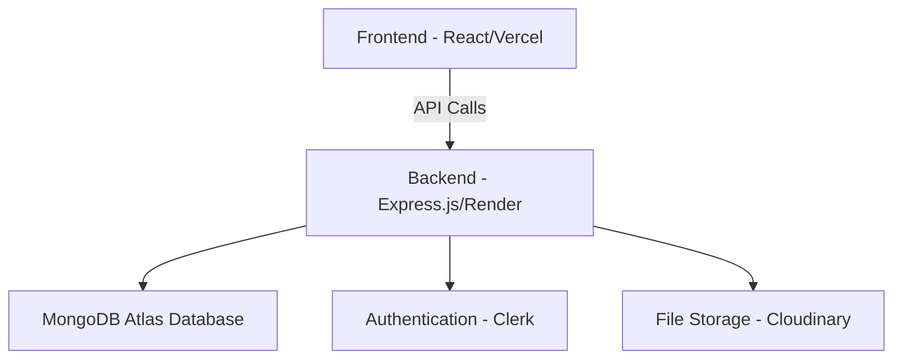

# 🏥 CareBridge – Global Hospital Connectivity Platform

Connect hospitals, transfer patients, and access medical reports seamlessly across the world.

## 📖 Table of Contents

- [About the Project](#-about-the-project)
- [Problem Statement](#-problem-statement)
- [Solution Overview](#-solution-overview)
- [Tech Stack](#-tech-stack)
- [Features](#-features)
- [System Architecture](#️-system-architecture)
- [Installation Guide](#️-installation-guide)
- [Usage](#-usage)
- [API Endpoints](#-api-endpoints)
- [Future Enhancements](#-future-enhancements)
- [Folder Structure](#️-folder-structure)
- [Contributing](#-contributing)
- [License](#-license)
- [Authors](#-authors)

## 💡 About the Project

CareBridge is a MERN-based health-tech web application designed to create a digital bridge between hospitals globally. It allows healthcare institutions to securely share patient data, transfer requests, and reports without endless phone calls or paperwork.

The system enables:

- Real-time patient transfer between hospitals
- Instant access to medical records and reports
- Secure, cloud-based data management

## 🚨 Problem Statement

Currently, hospitals face:

- Difficulty in sharing patient information during transfers
- Paper-based or manual data exchange
- Communication delays during emergencies
- Lack of unified digital infrastructure for hospital interoperability

These challenges can cost time and lives in critical cases.

## 💊 Solution Overview

CareBridge solves this by offering:

- A centralized digital platform for hospital-to-hospital communication
- Secure patient record management with authentication
- Real-time patient transfer requests and tracking
- Cloud-based medical report sharing and access

## 🧠 Tech Stack

| Layer | Technology | Description |
|-------|------------|-------------|
| Frontend | React.js, TypeScript, Tailwind CSS, Shadcn/ui | Interactive hospital dashboard |
| Backend | Node.js, Express.js | RESTful APIs & authentication |
| Database | MongoDB Atlas | Stores hospital and patient data |
| Authentication | Clerk | Secure user authentication |
| Real-Time Communication | Socket.IO | Live notifications and updates |
| Deployment | Vercel (Frontend), Render (Backend) | Cloud hosting |

## ✨ Features

- ✅ Hospital Registration & Login
- ✅ Add / View / Update / Delete Patient Records
- ✅ Search Patients by Hospital
- ✅ Transfer Request System
- ✅ Medical Report Upload
- ✅ Analytics Dashboard for Hospital Activity
- ✅ Role-based Access (Admin, Doctor, Nurse)
- ✅ Real-time transfer notifications

## 🏗️ System Architecture



## ⚙️ Installation Guide

### 1️⃣ Clone the Repository
```bash
git clone https://github.com/yourusername/carebridge.git
cd carebridge
```

### 2️⃣ Setup Backend
```bash
cd backend
npm install
```

Create `.env` file:
```env
NODE_ENV=development
PORT=5000
CLERK_SECRET_KEY=your_clerk_secret
HOSPITAL_A_MONGO_URI=mongodb+srv://...
HOSPITAL_B_MONGO_URI=mongodb+srv://...
ALLOWED_ORIGINS=http://localhost:3000,http://localhost:5173,https://your-frontend-domain.vercel.app
```

Run the backend:
```bash
npm start
```
Server runs on: http://localhost:5000

### 3️⃣ Setup Frontend
```bash
cd ../Frontend
npm install
```

Create `.env` file:
```env
VITE_CLERK_PUBLISHABLE_KEY=your_clerk_publishable_key
VITE_API_BASE_URL=http://localhost:5000/api
```

Run the frontend:
```bash
npm run dev
```
Frontend runs on: http://localhost:5173

## 🧭 Usage

### ➕ Add a Patient
1. Navigate to the "Patients" page
2. Click "Add Patient"
3. Fill in patient details
4. Click "Submit"

### 📋 View Patients
- Dashboard shows patient statistics
- Patients page lists all patients with search and filter options

### 🔄 Transfer Patient
1. Go to Transfer page
2. Search for patient
3. Select destination hospital
4. Fill transfer details
5. Submit transfer request

## 🔌 API Endpoints

| Method | Endpoint | Description |
|--------|----------|-------------|
| GET | `/api/patients/:hospitalId` | Get patients by hospital |
| POST | `/api/patients/:hospitalId` | Add new patient |
| GET | `/api/doctors/:hospitalId` | Get doctors by hospital |
| POST | `/api/transfer/patient` | Transfer patient |
| GET | `/api/health` | Health check |

## 🚀 Future Enhancements

- 🌐 Real-time hospital communication (WebSocket)
- 📎 Enhanced file upload for diagnostic reports
- 🌍 International hospital directory
- 🧠 AI health data insights
- 🔐 Advanced role-based permissions
- 📊 Advanced analytics and reporting

## 🗂️ Folder Structure

```
carebridge/
├── backend/
│   ├── config/
│   ├── core/
│   ├── hospitals/
│   ├── middleware/
│   ├── routes/
│   ├── services/
│   ├── utils/
│   ├── seed/
│   ├── server.js
│   └── package.json
├── Frontend/
│   ├── public/
│   ├── src/
│   │   ├── components/
│   │   ├── pages/
│   │   ├── hooks/
│   │   ├── lib/
│   │   └── App.tsx
│   ├── index.html
│   ├── vite.config.ts
│   └── package.json
├── vercel.json
└── README.md
```

## 🤝 Contributing

1. Fork the repository
2. Create a new branch: `git checkout -b feature-name`
3. Commit changes: `git commit -m 'Add new feature'`
4. Push: `git push origin feature-name`
5. Open a Pull Request

## 🧾 License

This project is licensed under the MIT License — feel free to use and modify for educational or professional use.

## 👨‍💻 Authors

- **Abubakr Parvez**
- **Thamir Khalid**
